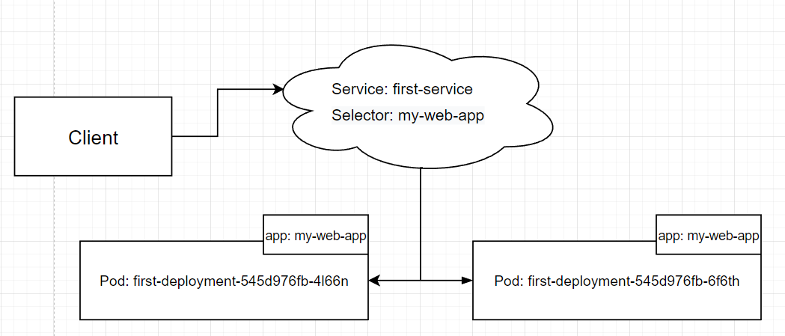

## Что такое Service и Ingress? - основные понятия, виды ресурсов + манифесты для каждого типа ресурсов

Для понимания сервисов, предлагаю рассмотреть некоторые свойства подов:
- Поды эфемерны, они могут появляться и исчезать в любое время, например из-за удаления пода с ноды, с целью освобождения места для других подов, или выхода из строя ноды.
- Нет возможности заранее узнать IP-адрес пода. В момент создания пода ему присваивается уникальный идентификатор, и k&s планирует на какой ноде будет размещен данный под.
- У каждого пода свой IP-адрес. Одно из правил сетевой политики Kubernetes гласит, что поды могут напрямую взаимодействовать между собой, при условии, что они развернуты на одном кластере. Для организации такого взаимодействия, каждый под должен обладать своим IP-адресом.
Решением всех вышеперечисленных проблем, являются сервисы. Сервисы предоставляют доступ к внешним ресурсам или экземплярам подов, которыми вы управляете напрямую на уровне виртуальных IP-адресов, иными словами, сервисы создают единую точку входа для набора из одного или несколько подов. Сервисы работают на транспортном уровне модели OSI(TCP/UDP)..

Итак, сервисы способны манипулировать несколькими подами, данный механизм реализован за счет атррибута labels(метка), которая в свою очередь представляет из себя пару “ключ-значение”, с помощю него групируются наборы объектов, в частности поды. Предлагаю рассмотреть два манифеста, для понимания того как это работает:


Первый деплоймент:
```
apiVersion: apps/v1 
kind: Deployment // тип контроллера
metadata: 
  name: first-deployment // задаем namespase поду, при помощи которых можно разделить поды
  labels: 
    app: my-web-app // задаем метку поду
spec: 
  replicas: 2 // указываем количество реплик
  selector: 
    matchLabels: 
      app: my-web-app
  template: 
    metadata: 
      labels: 
        app: my-web-app
    spec: // описание контейнера
      containers: 
      - name: my-pod
        image: ifilyaninitmo/itdt-contained-frontend:master
        ports: 
        - containerPort: 3000
        env: 
        - name: REACT_APP_USERNAME 
          value: "progML" 
        - name: REACT_APP_COMPANY_NAME 
          value: "itmo"
```
Второй сервис:
```
apiVersion: v1
kind: Service // тип контроллера
metadata:
  name: first-service
spec:
  selector:
    app: my-web-app // селектор для поиска подов
  type: LoadBalancer 
  ports:
  - protocol: TCP
    port: 3000
    targetPort: 3000 // обращаясь к Сервису по порту 3000 нас будет перенаправлять на порт 3000 Пода. 
```

Задеплоив данные манифесты и запустив наше приложение, при обновлении страницы, мы увидим разницу у “container name”. Это связанно с тем, что сервис распределяет запросы между подми, осуществляя их поиск по селекторам, данный механизм можно увидеть на картинке:



Типы сервисов (любой из нижеперечисленных сервисов будет балансировать нагрузку между подами, если их больше одного.)

- ClusterIP cервису будет выделен отдельный статичный IP-адрес, который не будет изменяться, даже после удаления сервиса, данный IP-адрес будет доступен с других подов кластера, а также со всех его нод. Выбор данного типа сервиса, подразумевает что сервисам будет доступным только изнутри кластера.

- NodePort позволяет открыть на всех Нодах кластера порт. При обращении к любой Ноде кластера по этому порту, запрос попадёт на тот Под, Лейбл которого указан в Селекторе Сервиса. Сервис доступен не только по внутреннему IP и порту кластера, но и через выделенный порт на всех узлах. Создавая службу NodePort, Kubernetes резервирует порт на всех своих узлах (на всех них используется один и тот же номер порта) и перенаправлять входящие соединения на поды, являющиеся частью службы. К службе NodePort можно получить доступ не только через внутренний IP-адрес кластера, но также через IP-адрес любого узла.
- LoadBalancer открыть внешний доступ и жестко привязать внешний IP адрес к сервису. Делает сервис доступным через выделенный балансировщик нагрузки, предоставляемый из облачной инфраструктуры, в которой работает Kubernetes. Балансировщик нагрузки перенаправляет трафик на порт узла через все узлы, минусом такого подхода является то, что трафик может приходить на ноду, на которой нет данного пода. Клиенты подключаются к сервису через IP балансировщика нагрузки. Балансировщик нагрузки будет иметь свой собственный уникальный общедоступный IP-адрес и будет перенаправлять все соединения. Таким образом, можно получить доступ к своему сервису через IP-адрес балансировщика нагрузки.
- Ingress  выполняет роль маршрутизатора или контроллера, направляя трафик к службам через средство балансировки нагрузки. Это удобный вариант, если необходимо использовать один IP-адрес для предоставления доступа к нескольким службам.


Важным недостатком LoadBalancer, является что для каждой такой службы требуется собственный балансировщик нагрузки с собственным общедоступным IP-адресом, в то время как для Ingress требуется только один. Ingress-ы работают на прикладном уровне модели OSI.
В современной инфраструктуре нам хочется уметь гибко взаимодействовать с внешними запросами - проксировать их. Заводить отдельный LoadBalancer-Service на каждый микросервис будет излишни. Было бы здорово иметь один центральный сервис, который можно было бы легко настраивать.

К примеру, роутинг, основывающийся на домене, с которого приходит запрос, или на основе пути URL-адреса - так мы можем имея один LoadBalancer настроить доступ к нескольким внутренним сервисам. Или, скажем, настройка CORS-политик, подключение TLS, настройка таймаутов.

В классической инфраструктуре, как правило, используются решения по типу NGINX, Apache, Envoy. Но каждый из них имеет свой синтаксис, свою документацию, и нам пришлось бы разбираться с каждым из них

Кубернетес-сообщество решило эту проблему, придумав так называемый Ingress - это своего рода стандартизированного API или единого интерфейса взаимодействия со всеми прокси-решениями. А под капотом уже конкретная реализация Ingress-контроллера настраивает NGINX/Apache/Envoy в соответствии с их внутренней конфигурацией.

Пример Ingress-манифеста:
```
kind: Ingress
metadata:
 name: simple-fanout-example
spec:
 ingressClassName: nginx
 rules:
 - host: foo.bar.com
   http:
     paths:
     - path: /
       pathType: Prefix
       backend:
         service:
           name: frontend
           port:
             number: 3000
     - path: /api
       pathType: Prefix
       backend:
         service:
           name: backend
           port:
             number: 8080
 
```
Хочется отметить одну из интересных особенностей. В манифесте выше есть поле ingressClassName - если мы захотим переехать с nginx на какой-нибудь envoy, нам достаточно будет просто изменить это значение - и все заработает (при условии, что нужный ingress-контроллер установлен). Однако, все ingress-контроллеры имеют свой собственный уникальный внутренний функционал, который выходит за рамки стандартного Ingress.
