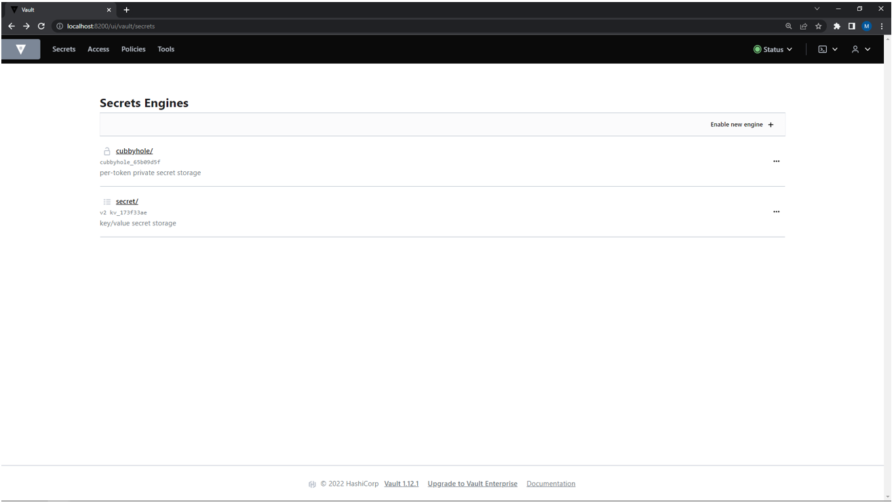
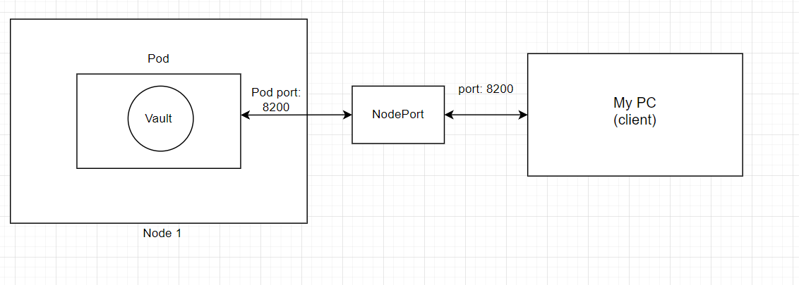

University: [ITMO University](https://itmo.ru/ru/)    
Faculty: [FICT](https://fict.itmo.ru)    
Course: [Introduction to distributed technologies](https://github.com/itmo-ict-faculty/introduction-to-distributed-technologies)    
Year: 2022/2023    
Group: K4111c    
Author: Lesonen Matvey Olegovich    
Lab: Lab1    
Date of create: 6.10.2022    
Date of finished: 16.11.2022
___
## Ответы на вопросы   
### 1. Что сейчас произошло и что сделали команды указанные ранее?
- `minikube start` произошел запуск minikube, который представляет из себя кластер из одной ноды.
- `kubectl apply -f manifest.yaml` для работы ранее запущенного кластера, я использую утилиту kubectl,  данная команда сохраняет написанный ранее манифест и деплоит под.
- `minikube kubectl -- expose pod vault --type=NodePort --port=8200` данная команда создает сервис для открытия доступа к приложению по порту 8200.
- `minikube kubectl -- port-forward service/vault 8200:8200` прокидываю порт локальной машины (моего компьютера) в контейнер.
-  `minikube stop` завершаю работу minikube.
### 2. Где взять токен для входа в Vault?
Использовать команду `kubectl logs vault` результат работы которой выведет:
 
Выполнив все вышеуказанные действия, мы получим следующий результат:
 
___
## Схема организации контейеров и сервисов нарисованная вами в draw.io или Visio.
После отправки клиентского запроса на 8200 порт, прокинутого внутрь кластера, происходит обращение к поду, на котором развернуто приложение Vault.
 
