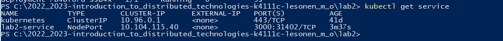
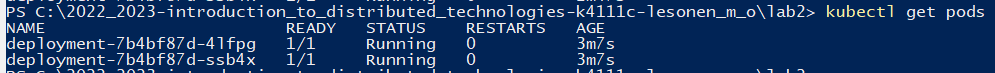
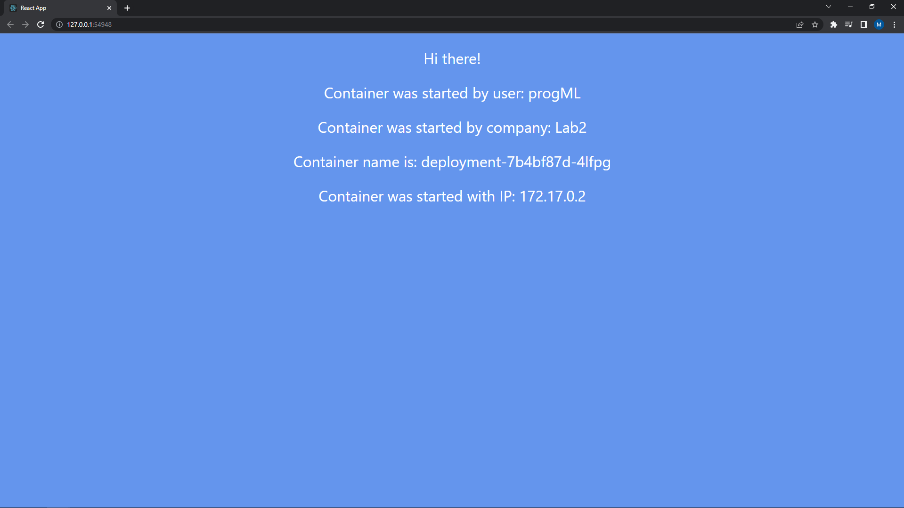
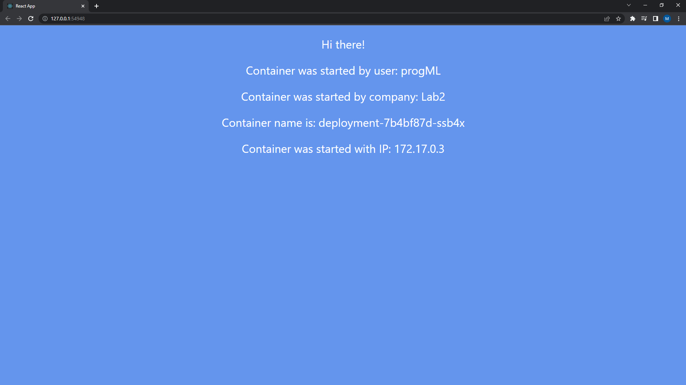
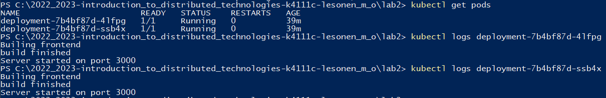
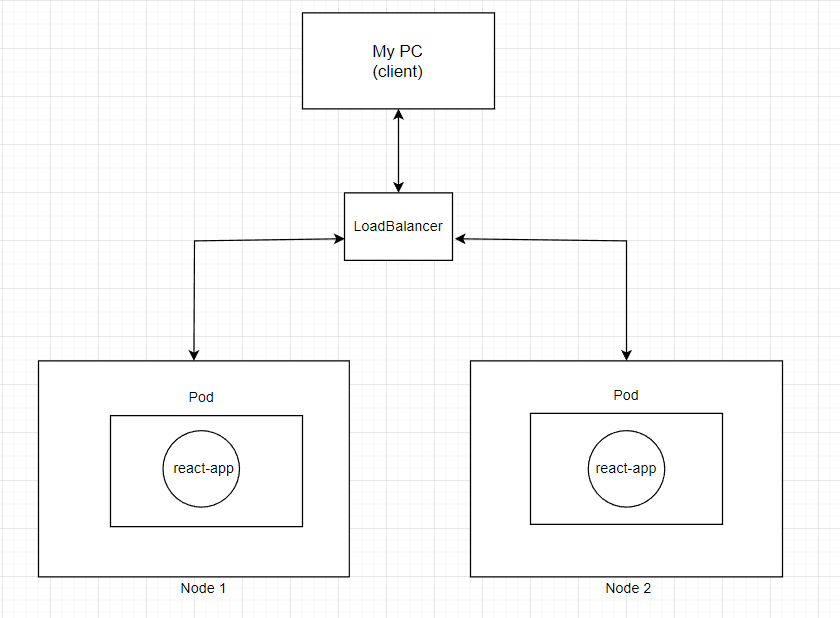

University: [ITMO University](https://itmo.ru/ru/)    
Faculty: [FICT](https://fict.itmo.ru)    
Course: [Introduction to distributed technologies](https://github.com/itmo-ict-faculty/introduction-to-distributed-technologies)    
Year: 2022/2023    
Group: K4111c    
Author: Lesonen Matvey Olegovich    
Lab: Lab2    
Date of create: 14.11.2022    
Date of finished: 17.11.2022
___
## Ответы на вопросы
### 1. Что сейчас произошло и что сделали команды указанные ранее?
- `minikube start` произошел запуск minikube, который представляет из себя кластер из одной ноды.
- `kubectl apply -f lab2-service.yaml` сохранение и деплой сервиса.
- `kubectl get service` проверка создания нового сервиса с типом LoadBalancer. Результат:

 
- `kubectl apply -f lab2-deployment.yaml` сохранение и деплой деплоймента.
- `kubectl get pods` проверка создания подов, в нашем случае их два, поскольку именно столько реплик мы сделали. Результат:

Подключение к контейнеру происходит через сервис, данную процедуру можно выполнить двумя способами:
- `minikube service lab2-service`
- `minikube kubectl -- port-forward service/lab2-service 3000:3000`

В качестве типа сервиса мной был выбран LoadBalancer, ниже представлена описание основных типов сервисов:

- `ClusterIP` дефолтный сервис, выбор которого, подразумевает что под доступен только изнутри кластера. Имеет риск потерять внешний IP адрес при переезде Пода.
- `LoadBalancer` используется если нужно поднять реплику бд со статическим IP адресом.
- `NodePort` открывает на всех Нодах кластера порт (у всех нод будет один порт). Обладает ограниченным набором портов.

В качестве типа контроллера, в задании было указано выбрать `deployment`, ниже представленно описание некоторых контроллеров:

- `Deployment` ищет поды по лейблам, после чего проверяет состояние пода, на соответсвие описанию в файле .yaml.
- `DaemonSet` поддерживает по одной реплике Пода на каждой из Нод кластера.
- `Job` подннимает под, отрабатывает, после чего завершает выполнение.
- `CronJob` работает как предыдущей контроллер, однако запуск происходит по расписанию. 

### 2. Проверьте на странице в веб браузере переменные REACT_APP_USERNAME, REACT_APP_COMPANY_NAME и Container name. Изменяются ли они? Если да то почему?

В результате выполнения всех вышеперечисленных действий, получаем следующий результат:

Если обновить странницу, то произойдет изменение поля `Container name`:

Поля `REACT_APP_USERNAME` и `REACT_APP_COMPANY_NAME` остаются не изменными, поскольку это константы, указанные в манифесте, а поле `Container name` изменяется, т.к. сервис распределяет запросы между двумя нодами.

### 3. Логи контейнеров

___
## Схема организации контейеров и сервисов нарисованная вами в draw.io или Visio.

