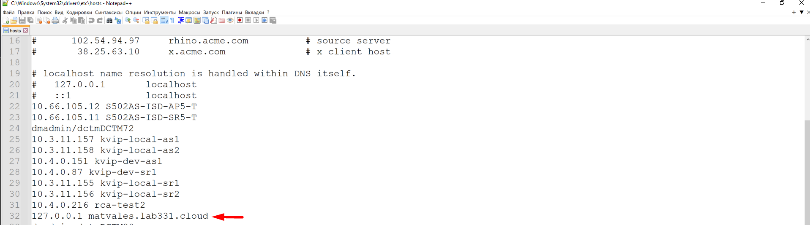
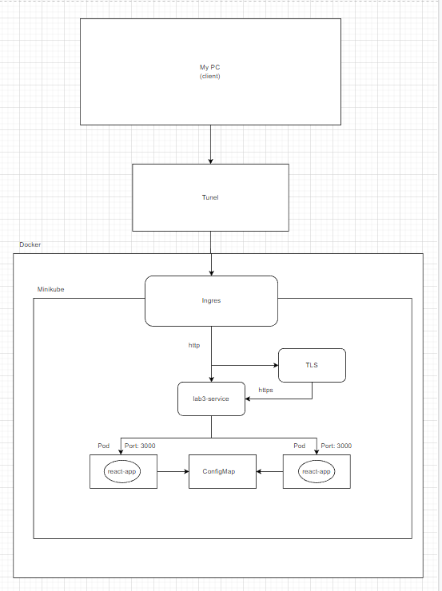

University: [ITMO University](https://itmo.ru/ru/)    
Faculty: [FICT](https://fict.itmo.ru)    
Course: [Introduction to distributed technologies](https://github.com/itmo-ict-faculty/introduction-to-distributed-technologies)    
Year: 2022/2023    
Group: K4111c    
Author: Lesonen Matvey Olegovich    
Lab: Lab3   
Date of create: 16.11.2022    
Date of finished: 19.11.2022
___
## Запуск

Создаем и деплоим все необходимые компоненты:
```bash
kubectl apply -f lab3-configmap.yaml
kubectl apply -f lab3-replicaset.yaml
kubectl apply -f lab3-service.yaml
```
Создаем сертификат TLS и secrets:
```bash
openssl req -x509 -newkey rsa:4096 -sha256 -nodes -keyout tls.key -out tls.crt -subj "/CN=matvales.lab331.cloud" -days 20
kubectl create secret tls lab3-tls --cert=tls.crt --key=tls.key
```
Добавляем созданный ingress:
```bash
kubectl apply -f lab3-ingress.yaml
```
Конфигурирем minikube для работы с ingress:
```bash
minikube addons enable ingress
minikube addons enable ingress-dns
```
Добавляем ip-адрес приложения и имя хоста в дирикторию C:\Windows\System32\drivers\etc



После чего создаем тунель следующей командой:
```bash
minikube tunnel
```

Получаем следующий результат:


Как можно заметить, обратиться по https не удалось. Это связано с проблемами моего окружения, проверив правильность выполняемых мной действий, Иван Викторович разрешил сдать работу с http.

## Схема организации контейеров и сервисов нарисованная вами в draw.io или Visio.
