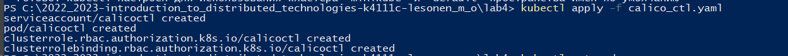
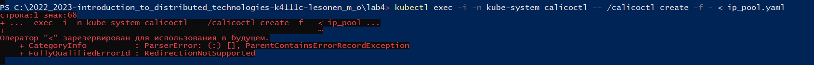
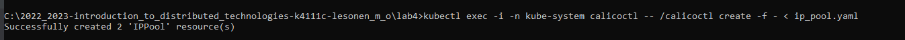
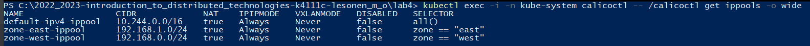
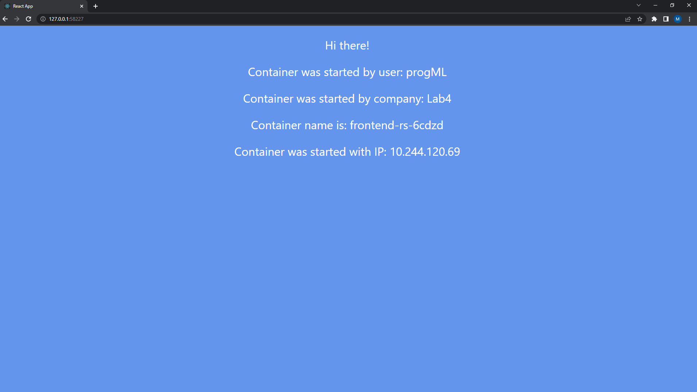
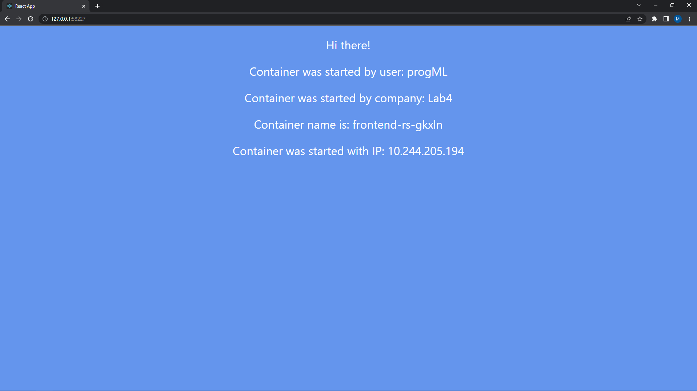
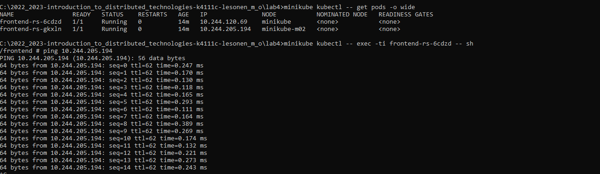
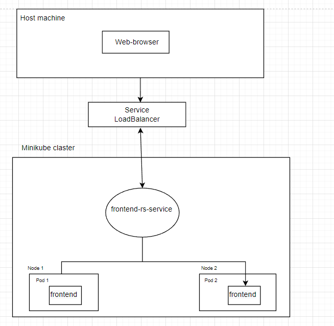

University: [ITMO University](https://itmo.ru/ru/)    
Faculty: [FICT](https://fict.itmo.ru)    
Course: [Introduction to distributed technologies](https://github.com/itmo-ict-faculty/introduction-to-distributed-technologies)    
Year: 2022/2023    
Group: K4111c    
Author: Lesonen Matvey Olegovich    
Lab: Lab4 
Date of create: 01.12.2022
Date of finished: 01.12.2022
___
## Создание кластера minikube
После установки плагина "calico", разворачиваем 2 ноды следующей командой:
```bash
minikube start --nodes 2 --cni calico --kubernetes-version=v1.24.3
```
Проверяем количество созданных нод:


Деплою манифест для создания calico пода, слудющей командой:

___
## Создание IP-пулов и всех необходимых компонентов

Деплой манифеста, написанного для IP-пулов, был выполнен следующей командой:
```bash
kubectl exec -i -n kube-system calicoctl -- /calicoctl create -f - < ip_pool.yaml
```
При выполнении ее в powershell, возникли проблемы

Использовал CMD и все сработало 


Проверил созданный IP-пулы, слудеющей командой:
```bash
kubectl exec -i -n kube-system calicoctl -- /calicoctl get ippools -o wide
```
Получил следующей резултьтат

Деплоим replica set,config map и svc следующей командой:
```bash
kubectl apply -f configmap_replicaset_service.yaml
```
___
## Подключение к контейнеру через браузер
Пробросив порты, я получил следующию веб-страницу

Обновив страницу произошло изменение полей "Container name" и "Container IP", причина та же что и во второй лабораторной работе,
сервис распределяет нагрузку межу существующими репликами

___
## Пропинговка подов
Получаю информацию о подах, слудующей командой:
```bash
minikube kubectl -- get pods -o wide
```
Пингую от первого пода к второму

Пингую от второго пода к первому

___
## Схема организации контейеров и сервисов нарисованная вами в draw.io или Visio.
